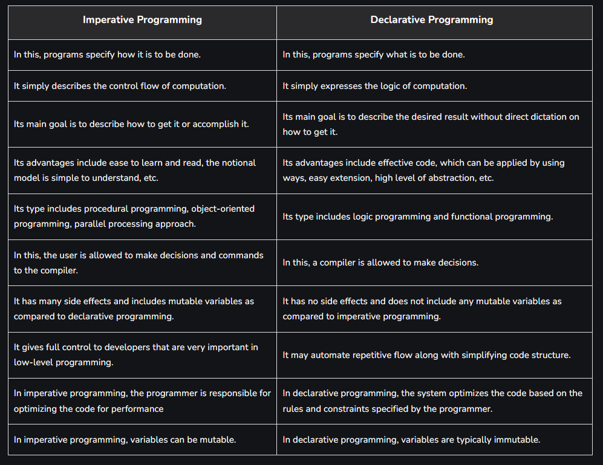

# Programming Paradigms

A programming paradigm is an approach to solve problems using some programming language, or we can say it is a method to solve a problem using tools and techniques available to us following a specific approach. There are numerous programming languages, and each of them adheres to certain methodologies or paradigms to address various demands.

## Imperative Programming

Imperative Programming, as the name suggests, is a programming paradigm that describes how a program executes. Developers are more concerned with the step-by-step process of obtaining a solution. It comprises a sequence of command imperatives, where the order of execution is crucial. Both mutable and immutable data can be used in this paradigm. Examples of imperative programming languages include Fortran, Java, C, and C++.

## Declarative Programming

Declarative Programming, on the other hand, is a programming paradigm that describes what programs should be executed. Developers are more concerned with the results they want to achieve. It declares the desired results and focuses on figuring out how to produce them, leaving the specifics of the programming language aside. In essence, it prioritizes the end result and expresses the logic of computation. Popular examples of declarative programming languages include Miranda, Erlang, Haskell, and Prolog.

